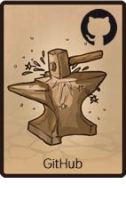
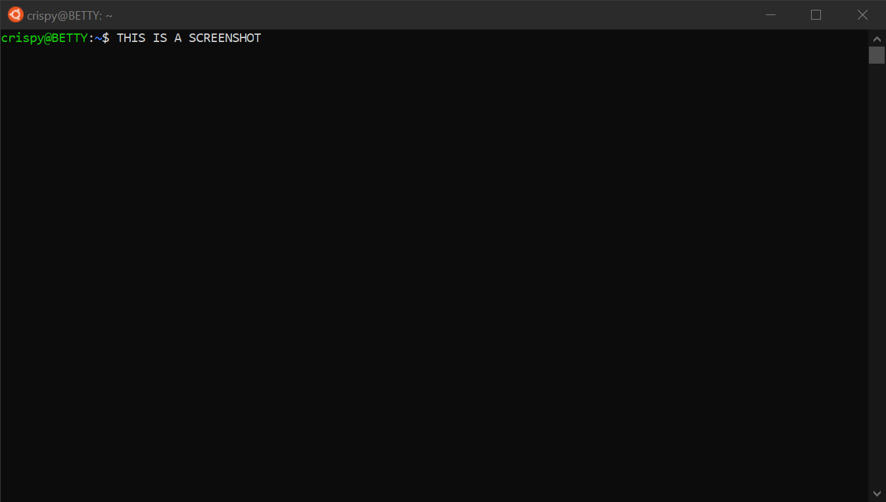

<!--
  project-templates 201024
  project-templates-github-general-project-repository-template 201024
-->

***

<h3 align="center">

  THIS REPOSITORY HAS BEEN ARCHIVED 
  THIS REPOSITORY HAS BEEN DEPRECIATED 
  THIS IS ALPHA/BETA SOFTWARE

</h3>

<h4 align="center">

  Development is continuing at [repository-name](URL). 
  Use at your own risk

</h4>

***

<h3 align="center">

  
   
  A GitHub template for a general project repository.
   

</h3>

<h2 align="center">

  &nbsp;&nbsp;
   

</h2>

<h1 align="center">

  
   

</h1>

<h6 align="center">

  [WEBSITE](URL)&nbsp;&bull;&nbsp;[DEMO](URL)&nbsp;&bull;&nbsp;[MANUAL](doc/manual/manual.md)&nbsp;&bull;&nbsp;[CHANGELOG](doc/repository/changelog.md)&nbsp;&bull;&nbsp;[ROADMAP](doc/repository/roadmap.md)&nbsp;&bull;&nbsp;[KNOWN ISSUES](doc/repository/known-issues.md)&nbsp;&bull;&nbsp;[SUPPORT](doc/repository/support.md)
   

</h6>

<!-- The HTML indentations have to stay this way to work. -->
<table>
<tr>
<td img src="RepositoryData/Asset/Image/Document/README/spacer.png" alt="blank-spacer" width="1000" height="1">

  ### CONTENTS
  [ABOUT](#about) 
  [GETTING STARTED](#getting-started) 
  [INSTALLING](#installing) 
  [SETUP](#setup) 
  [USING](#using) 
  [COMPILING](#compiling) 
  [TESTING](#testing) 
  [API](#api) 
  [DEVELOPMENT](#development) 
  [ADDITIONAL INFORMATION](#additional-information) 

</td>
</tr>
</table>

# ABOUT
This is a template for GitHub repositories.

### Features
* Feature #1
* Feature #2
* Feature #3

# GETTING STARTED

### Before you begin
Things you should do before you begin.

### Prerequisites
* Prerequisite #1
* Prerequisite #2
* Prerequisite #3

# INSTALLING

### Windows
1. The steps to install the project in Windows
2. Use both Markdown and/or HTML
3. Include screenshots when possible.

### MacOS
1. The steps to install the project in MacOS
2. Use both Markdown and/or HTML
3. Include screenshots when possible.

### Linux
1. The steps to install the project in Linux
2. Use both Markdown and/or HTML
3. Include screenshots when possible.

### Other operating systems
1. The steps to install the project in other operating systems
2. Use both Markdown and/or HTML
3. Include screenshots when possible.
4. If other operating systems are not supported, mention that here.

# SETUP
If your project has a setup procedure, document it here.

For example, you may need to make changes to a configuration file before using the project.

### Configuring
Configuration introduction.

#### Required configuration settings
Required configuration settings go here.

#### Recommended configuration settings
Recommended configuration settings go here.

#### Optional configuration settings
Optional configuration settings go here.

### Important notes about options
Optional/important notes about options go here.

# USING
Usage instructions go here.

# UPDATING
Updating instructions go here

# UNINSTALLING
Instructions for uninstalling go here.

# COMPILING
Compling information blurb goes here.

### Making
Making instructions go here.

### Building
Building instructions go here.

### Deploying
Deployment instructions go here.

# TESTING
Testing instructions go here.

# HOW IT WORKS
Sometimes it's fun to let users know how the magic happens.

# API
If your project contains an API, it should be documented here (or link to the documentation).

# FAQ

### Are you nice?
I think so.

# DEVELOPMENT
A blurb about development can go here.

* [Project homepage](https://github.com/github-account/repository-name)
* [Changelog](repository-data/doc/changelog.md)
* [Roadmap](repository-data/doc/roadmap.md)
* [Known issues](repository-data/doc/known-issues.md)
* [Support](repository-data/doc/support.md)
* [Testing](repository-data/doc/testing.md)
* [Built with](repository-data/doc/built-with.md)
* [Contributors](repository-data/doc/contributors.md)
* [Acknowledgements](repository-data/doc/acknowledgements.md)
* [Notices](repository-data/doc/third-party-notices.md)
* [Related projects](repository-data/doc/related-projects.md)
* [Additional reading](repository-data/doc/additional-reading.md)

### Contributing
If you are interested in contributing to this project, please see our:
* [Code of conduct](repository-data/doc/code-of-conduct.md)
* [Contributing guidelines](repository-data/doc/contributing.md)
* [Testing procedures](repository-data/doc/testing.md)
* [Issue template](repository-data/doc/issue-template.md)
* [Pull request template](repository-data/doc/pull-request-template.md)

### Repository
* [Issues](https://github.com/github-account/repository-name/issues)
* [Pull request](https://github.com/github-account/repository-name/pulls)
* [Projects](https://github.com/github-account/repository-name/projects)
* [Wiki](https://github.com/github-account/repository-name/wiki)
* [Insights](https://github.com/github-account/repository-name/pulse)

***

<!-- DEVELOPMENT FOOTER -->
&nbsp;&nbsp;&nbsp;&nbsp; 
